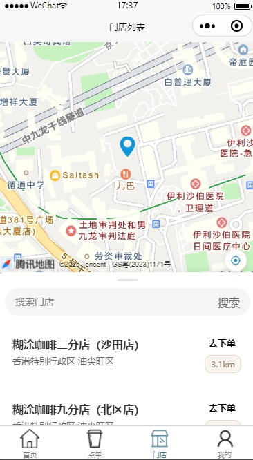
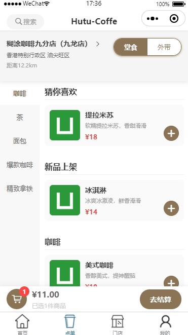
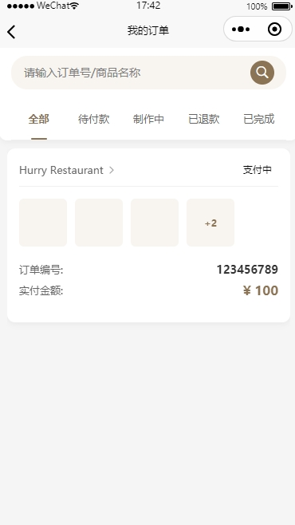
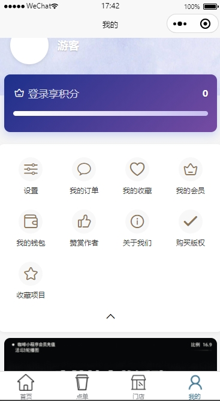

# hutu-order-web

糊涂点餐小程序端

父仓库：https://github.com/isnott/hutu-order

## 重构进度

目前所有数据使用mock数据，框架使用Vue3+UniAPP。
除开没有真实数据以外，还欠缺支付模块【暂不会添加】、我的收藏、预定点单到店时间组件等。
大致架子已完成。

## 运行

0. npm install
1. 替换manifest.json中的appid
2. npm run dev
3. 运行Hutu-oder-app的api端

## 预览

